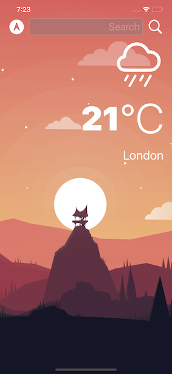
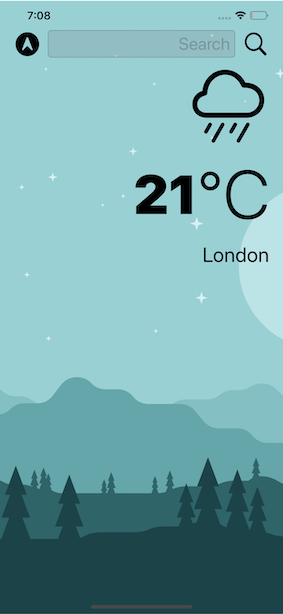

#  Clima

A beautiful, dark-mode enabled weather app. That allows you check the weather for the current location based on the GPS data from the iPhone as well as by searching for a city manually. 

## Getting Started

Fork the project and run on your device 

## Prerequisites

Ability to fork a project 🙂

## Screen shots

Dark mode

Light mode

## Acknowledgments

This is a companion project to The App Brewery's Complete App Development Bootcamp, check out the full course at [www.appbrewery.co](https://www.appbrewery.co/)